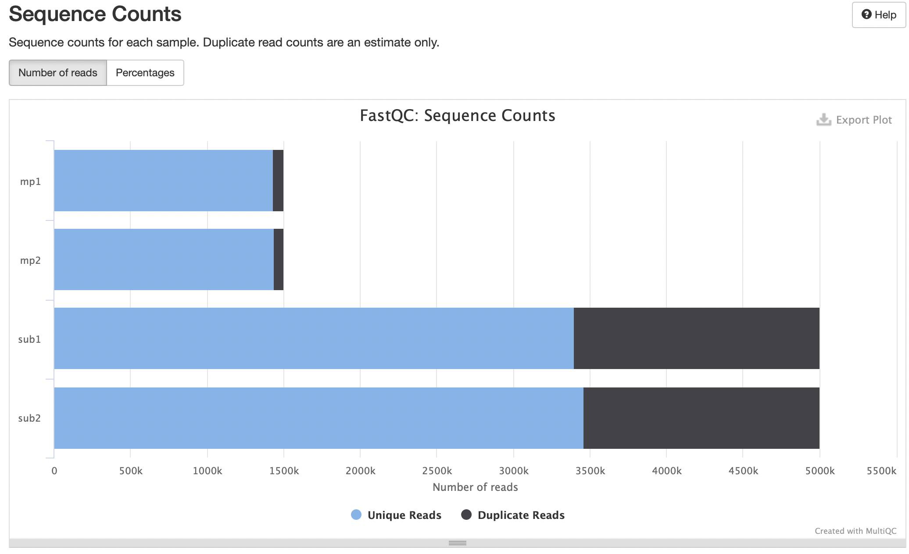
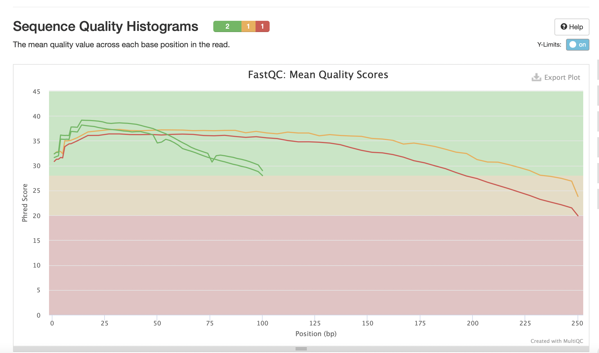

# hse21_hw1
Запустим последовательно следующие команды (все в соответствии с инструкцией по дз)
```
bash
ln -s /usr/share/data-minor-bioinf/assembly/oil_R1.fastq
ln -s /usr/share/data-minor-bioinf/assembly/oil_R2.fastq
ln -s /usr/share/data-minor-bioinf/assembly/oilMP_S4_L001_R1_001.fastq
ln -s /usr/share/data-minor-bioinf/assembly/oilMP_S4_L001_R2_001.fastq
seqtk sample -s1901 oil_R1.fastq 5000000 > sub1.fastq
seqtk sample -s1901 oil_R2.fastq 5000000 > sub2.fastq
seqtk sample -s1901 oilMP_S4_L001_R1_001.fastq 1500000 > mp1.fastq
seqtk sample -s1901 oilMP_S4_L001_R2_001.fastq 1500000 > mp2.fastq
mkdir fastqc
mkdir multiqc
fastqc -o fastqc sub*.fastq mp*.fastq
multiqc -o multiqc fastqc
platanus_trim sub*
platanus_internal_trim mp*
rm sub*.fastq mp*.fastq
mkdir fastqc_trimmed
mkdir multiqc_trimmed
ls sub* mate_pair_*| xargs -tI{} fastqc -o fastqc_trimmed {}
multiqc -o multiqc *trimmed
platanus assemble -f *.trimmed

platanus scaffold -o Poil -c Poil_contig.fa -IP1 sub1.fastq.trimmed sub2.fastq.trimmed -OP2 mp1.fastq.int_trimmed mp2.fastq.int_trimmed

platanus gap_close -o Poil -c Poil_scaffold.fa -IP1 sub1.fastq.trimmed sub2.fastq.trimmed -OP2 mp1.fastq.int_trimmed mp2.fastq.int_trimmed

rm *trimmed
```




